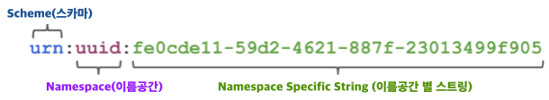
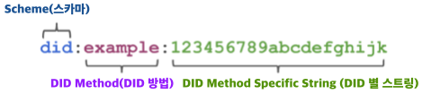
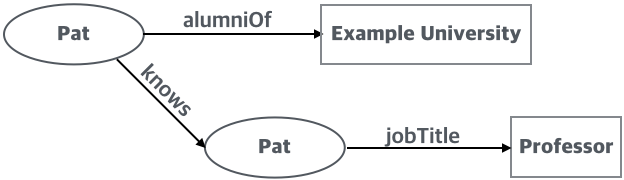
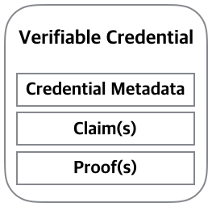
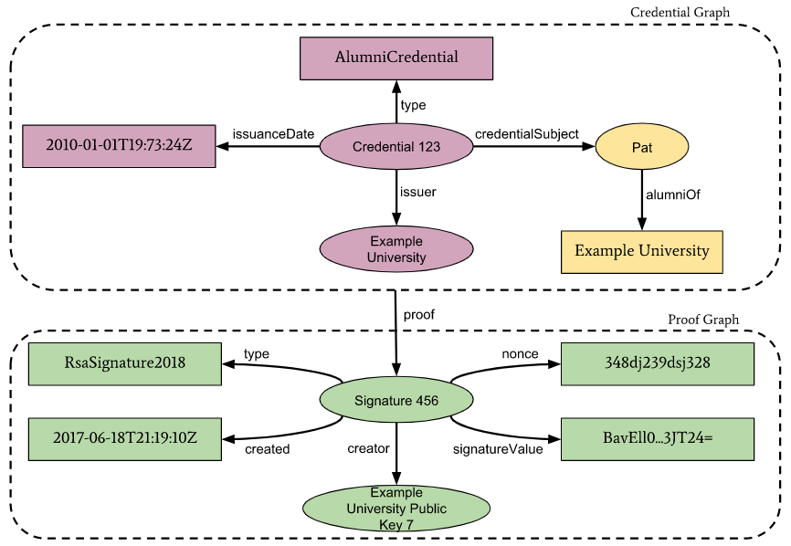

# 탈중앙형 식별자 (DID: Decentralized Identifier)

물리세계의 신원과 달리 디지털 신원은 인터넷에서 사람을 식별하기 위한 것으로 초기에는 ID/PW 기반이었다.

기존의 신원관리시스템은 도메인 이름 저장소 또는 인증기관과 같은 중앙집중화된 시스템에 기반하였기 때문에 
신원관리를 전담하는 중앙집중화된 기관은 독자적으로 신뢰의 기반을 구축하여야 한다. 
이러한 방식의 단순한 예는 정부가 생성한 여권으로 시민이 어디에 가든 신분증으로 사용할 수 있도록 하는 시스템에 의해 관리된다. 

블록체인 기술은 탈중앙형 신원관리시스템을 사용할 수 있는 기회를 제공한다. 이 시스템의 엔티티들은 모든 공유된 신뢰 기반을 자유롭게 사용할 수 있다. 
즉 블록체인 기술의 등장으로 권한이 있는 중앙 기관이 없어도 저장된 데이터의 신뢰성을 보장할 수 있는 탈중앙형 신원정보관리 시스템을 구현할 수 있게 한다.  

이 시스템에는 개인, 기관, 사물과 같은 개별 대상(object)을 탈중앙 식별자(DID: Decentralized Identifier)로 식별되고 
전자서명, 프라이버시가 보호된 생체정보 등과 같은 검증가능 신원정보 데이터로 인증된다. 

W3C DID WG의 정의에 따르면 탈중앙형 식별자는 분산원장 기술(distributed ledger technolology) 또는 다른 형태의 탈중앙형 네트워크에 등록되기 때문에 
중앙의 등록기관이 필요 없는 글로벌하게 유일한 식별자(globally unique identifier)로 정의한다.
DID는 W3C의 URN(Unified Resource Name: 영구적인 자원 이름)의 규격과 동일한 기본 패턴을 바탕으로 여러 블록체인에 적용하기 위해 표준화가 진행되었다.
DID는 사용자를 중심으로 개인 신원정보를 생성, 사용, 삭제 등 개인 신원정보를 관리할 수 있는 기반을 제공하여 '나'를 구별하고 '내'가 '나'임을 증명할 수 있는
방법을 제공한다. 

중앙의 등록기관을 요구하지 않는 글로벌 식별자에 대한 요구가 처음이 아니라 2016 년에 W3C의 URN(Unified Resource Name) 규격의 기본 패턴을 따라 
복수의 블록체인에서 동작할 수 있도록 DID를 적용하는 것이 논의되었다. DID에서는 URN의 이름 공간(namespace) 컴포넌트를 
DID 메소드를 규정하는데 사용하고 DID 메소드 규격은 메소드 별 식별자(method-specific identifier)의 형식을 정의한다.
다음은 uuid를 표현하는 URN을 표현하고 있다(출처:w3c). 

다음은 DID를 표현하고 있다.(출처:w3c)

디저털 공간에서 모든 개체(entity)는 필요한 수 만큼 (관련 DID 문서와 서비스 종단점 과 함께) DID를 가질 수 있다. 이는 신원(identity), 정체성(persona), 문맥(context)을 분리하려는 개채의 요구를 수용하기 위한 것이다.  

## DID 문서 (DID documents)

DID는 DID 문서를 가리킨다. w3c는 DID 문서를 "DID 주체(subject)가 자신을 인증하고 DID와의 연관성을 입증하는데 사용할 수 있는 공개키 및 생체 인식과 같은
메커니즘을 포함한 DID 주체를 설명하는 데이터 집합" 으로 정의한다. DID 문서는 주체를 설명하는 속성들 또는 주장(claim)들을 포함하기도 한다. 
일반적으로 이 문서는 JSON-LD를 사용하여 표현된 그래프 기반 자료 구조이나 호환 가능한 다른 그래프 기반 데이터 형식을 사용하여 표할될 수 있다.   
DID와 DID 문서는 탈중앙화된 신원의 기반이나 주체를 기술하는 첫 단계이다. 

## DID 방법 (DID method)

DID 방법은 특정 분산 원장 또는 네트워크에서 DID와 관련 DID 문서를 생성, 읽기, 갱신, 비활성화하는 메커니즘이다. 
특별한 탈중앙형 식별자에 DID와 DID 문서의 모든 기능을 가능하게 하기 위해서 DID 방법 명세(specification)은 클라이언트에서 실행되는 
CRUD (Create, Read, Update and Deactive) 작업의 동작 방법을 정의해야 한다.   

DID 방법은 중앙 집중형 신원관리시스템 또는 연합된 신원관리시스템을 위해서도 개발될 수 있다. 모든 유형의 신원관리시스템은 중앙집중형, 연합형,
탈중앙형 식별자 도메인 간 상호 운용성 브리지를 만들어서 DID 지원기능을 추가할 수 있다. 

## Related Terminologies (관련 용어) (defined by W3C Verifiable Credentials Data Model)

* credentials (신원정보): 일상 생활의 일부로 사실 또는 자격을 증명할 수 있는 데이터
   + 예: 운전 면허증, 의사 신분증, 졸업장, 여권, 사원증 등
   + 운전 면허증: 자동차 등을 운전할 수 있다고 주장하는데 사용
   + 졸업장: 교육 수준을 주장하는데 사용
   + 사원증: 근무 기관을 주장하는데 사용
   + 여권: 국가간 여행을 가능하는데 사용

이들 신원정보는 실제 환경에서 사용될 때 이점이 많은 반면 웹에서 사용은 아직 애매한 상황이다. 교육 증빙, 
건강관리 데이터, 재무 계정 세부 정보, 타 사에서 검증한 기계가 판독 가능한 개인 정보를 웹에 표현하는 것은 어렵다.
웹에서 디지털 신원정보 표현의 어려움은 물리적 신원정보가 물리 환경에서 제공하는 이점으로 웹에서도 
동일한 이점을 얻는 것을 어렵게 한다. 

물리 세계에서 신원정보는 다음과 같은 것으로 구성될 수 있다. 
   + 신원정보의 주체를 식별하는데 관련한 정보 (예: 사진, 이름, 주민 번호)
   + 발급기관 관련 정보 (예: 도시 정부, 국가 기관 또는 인증 기관)
   + 신원정보 유형 관련 정보 (예: 여권, 운전면허증, 건강보험 카드)
   + 주체와 관련하여 발급 기관이 주장하고 있는 속성과 속성 관련 정보 (예: 국적, 생년월일, 운전할 수 있는 차량 등급)
   + 신원정보가 만들어진 방법과 관련된 증거
   + 신원정보의 제약 조건과 관련한 정보 (예: 만료 날짜, 사용 조건)
   
* verifiable credentials(검증가능한 신원정보): 

김증가능 신원정보는 물리적인 신원정보가 표현하는 모든 정보를 표현할 수 있다. 
디지털 서명과 같은 기술들을 추가하여 검증가능한 신원정보가 물리적인 신원정보보다 변조되지 않고 더욱 신뢰할 수 있도록 한다.

   + 검증가능한 신원정보 보유자(Holder)는 특정 특성을 가진 검증가능한 신원정보를 가지고 있다는 것을 증명하기 위해서 
   verifiable presentation을 생성하고 검증자(verifier)와 공유한다.
   + 검증가능한 신원정보와 verifiable presentations(검증가능한 표현)은 신속하게 전달할 수 있으며
   이는 원거리에서 신뢰를 설정하려고 할 때 물리세계의 상황보다 좀 더 편리하게 만든다.      
   
* verifiable presentation(검증가능한 표현): 특정 검증자와 공유되는 하나 이상의 발급자가 발행한 하나 이상의 검증가능한 신원정보로 부터 파생된 데이터
    + 암호 검증 프로세스 후 데이터의 소유권을 신뢰할 수 있도록 인코딩하여 변조를 감지할 수 있는 표현
    + verifiable presentation의 형태에 오리지널 검증가능한 신원정보로 부터 합성이 되었으나 원 검증가능한 신원정보는
    포함하지 않는 데이터가 포함될 수 있다. (영-지식 증명)  
   
* entity(엔티티): 검증가능한 신원정보의 생태게(?)에서 하나 이상의 역할을 수행하는 사람, 조직, 디바이스와 같이 구별이 되고 독립적으로 존재하는 것(thing)

* digital signature(전자 서명): 디지털 메시지의 진위를 증명하기 위한 수학적인 절차 

## 생태계에 참여하는 주요 엔티티

* holder(보유자): 하나 이상의 검증가능한 신원정보(verifiable credentials)을 소유하고 신원정보로 부터 검증가능한 표현(presentation)을 생성하는 개체(entity) 
     + 에: 학생, 고객, 직원
  
* issuer(발급자): 검증가능한 신원정보(verifiable credentials)을 생성하여 특정 주체와 연결하여 보유자(holder)에게 전송하는 개체(entity) 
     + 예: 기업, 정부 또는 비영리 단체
 
* Subject(주체): 하나 이상의 검증가능한 신원정보를 주장하는 개체(entity)로 사람, 동물, 사물 등을 포함하고 있다. 
많은 경우 검증가능한 신원정보 보유자가 주체이나 그렇지 않은 경우도 있다. 예로 부모(보유자)는 아이(주체)에 대한 
검증가능한 신원정보를 가지거나 애완동물의 주인(보유자)는 그들의 애완동물(주체)의 검증가능한 신원정보를 가질 수 있다.

(Q) 사람과 사물과의 관계는 ?
 
* Verifier(검증자): 
보유자가 특정 특성을 가진 검증가능한 신원정보를 보유하고 있음을 증명하는 검증가능한 표현(verifiable presentation)내의 표현된 
하나 이상의 검증가능한 신원정보를 수신하고 검증한다. 
검증자의 예는 고용주, 보안 담당자, 웹사이트가 있다.
 
* Verifiable data registry(검증가능한 데이터 저장소): 검증가능한 신원정보를 사용하는데 요구될 수 있는 식별자와 검증가능한 신원정보 스키마, 해지 정보, 발급자의 키 등과 같은 관련 데이터의 생성 및 검증을 중재하는 시스템으로 일부 구성에서는 주체와 상관 가능하는 식별자들을 요구할 수 있다. 검증가능한 데이터 저장소의 예로는 신뢰할 수 있는 데이터베이스, 탈 중앙형 데이터베이스, 정부 신분 데이터베이스 및 분산 원장이 있다. 생태계에서는 사용가능한 검증가능한 데이터저장소 유형이 여러개 존재한다.  

### 생태게의 특성

* 검증가능한 신원정보는 발급자가 변조방지(temper-evident) 및 개인정보가 보호되는 방식으로 생성한 서류이다.
* 보유자는 다른 발급자가 발급한 검증가능한 신원정보들을 모아 하나의 검증가능한 표현(verifiable presentation)을 구성한다.
Q) verifiable presentation 의 모습
* 발급자는 모든 주체(subject)에 대해 검증가능한 신원정보를 발급할 수 있다. (사람, 사물, 조직 등에)
* 생태계 내에서 발급자, 보유자, 검증자로 활동하기 위해서 당시자 간 상호신뢰에 기반하기 떄문에 중앙기관에 등록 또는 허가가 필요하지 않다.
* 검증가능한 표현 검증자가 발급자가 발급한 검증가능한 신원정보의 진위여부를 검증할 수 있게 한다.
* 보유자는 누구에게서나 검증가능한 신원정보를 받을 수 있다. 
* 보유자는 사용자 에이전트(user agent)를 통해 모든 발급자와 검증자와 상호작용할 수 있다. [Q. user agent?]
* 보유자는 검증가능한 표현을 공유할 수 있으며 검증자의 신원을 발급자에게 공개하지 않고 검증받을 수 있다. (?)
* 보유자는 검증가능성에 영향을 미치지 않고 발급자가 저장장소와 접근시점에 대해 발급자가 알지 못한 채 어디에든 검증가능한 신원정보를 저장할 수 있다.
* 보유자는 주장의 진위에 영향을 미치지 않고 발급자에게 공개하지 않고도 검증가능한 표현을 모든 검증자에게 제시할 수 있다.
* 검증자는 발행자가 발급한 주장에 대한 증명이 포함된 보유자의 검증가능한 표현을 검증할 수 있다.
* 검증 작업은 발급자와 검증자의 직접적인 상호작용에 의존해서는 안된다. (?)
* 검증 작업에서 검증자의 신원이 발급자에게 공개해서는 안된다. 
* 이 생태계에서는 발급자에게 선택적 공개를 지원하는 검증가능한 신원정보를 발급하는 방법을 제공하여야 한다.
* 발급자는 선택적 공개를 지원하는 검증가능한 신원정보를 발급할 수 있다. 
* 검증가능한 신원정보가 선택적 공개를 지원하면 보유자는 모든 검증가능한 신원정보를 공개하지 않고 주장의 증명(proof of claims)를 제시할 수 있다. 
* 검증가능한 표현은 검증가능한 신원정보의 속성을 공개하거나 검증자의 요청한 파생 술어 (크다, 작다, 같다 등의 집합의 부울 조건)를 만족시킬 수 있다.
* 발급자는 취소 가능한 검증가능한 신원정보를 발급할 수 있다.
* 검증가능한 신원정보와 표현은 하나 이상의 컴퓨터가 판독할 수 있는 데이터 형식으로 직렬화되어야 한다. 
* 직렬화/역직렬화 절차는 결정적(determinstic), 양방향 및 무손실이어야 한다.
* 검증가능한 신원정보 또는 표현의 직렬화는 직렬화된 검증가능 신원정보가 상호운용이 가능한 방식으로 처리될 수 있도록 결정적인 방식으로 정의된 
일반적인 데이터 모델로 변환이 가능해야한다. 
* 직렬화된 양식은 데이터 또는 콘텐츠의 손실없이 데이터 모델로 부터 생성될 수 있어야 한다. 
* 데이터 모델과 직렬화는 최소한의 조정으로 확장되어야 한다.
* 발급자에 의한 취소는 주체, 보유자, 특정 검증가능 신원정보 또는 검증자에 관한 모든 식별정보를 공개하지 않아야 한다. 
* 발급자는 취소 이유를 공개할 수 있다.
* 검증가능한 신원정보를 취소한 발급자는 암호화 무결정에 대한 취소(서명키의 손상)와 상태 변경의 취소(예: 운전면허 정지)를 구분해야 한다. 
* 발급자는 검증가능한 신원정보를 새롭게 하는 서비스를 제공할 수 있다. 

## 디지털 증명 메커니즘 (Digital proof mechanisms)

디지털 서명의 일부인 디지털 증명 메커니즘은 검증가능한 신원정보의 보호를 보장하기 위해 필요하다. 
증명의 구문에 종속적인 증명을 보유하고 검증하는 것(예: 키 보유자를 증명하기 위해 JSON 토큰의 JSON 웹 서명 사용)은 검증가능한 신원정보를 처리하는데 필수적인 부분이다. 
W3C에서 검증가능 신원정보 데이터 모델을 표준 문서가 작성될 때 다음 세 가지 증명 방법을 사용하여 신원정보를 구현하였다. 

   * JSON Web Tokens secured using JSON Web Signatures (
   * Linked Data Signature (링크된 데이터 서명)
   * Camenisch-Lysyanskaya Zeor-Knowledge Proofs (영지식 증명)

## 개인 정보 (Personal Information)

개인 데이터는 정부에서 발급한 식별자, 배송지 주소, 이름 등을 포함하며 개체(entity)를 결정, 추적 및 상관시키기 위해 쉽게 사용될 수 있다. 
이 데이터는 프라이버시 위반에 민감하고 취약한다. 개인적으로 식별가징하니 않는 데이터조차도 다수에게 노출될 수 있다. 
에로 생년월일과 우편번호의 조합은 매우 강력한 상관관계와 익명해제능력을 가질 수 있다. 

## 주장 (Claims)

주장(claim)은 주체(subject)에 관한 서술(statement)이다.
기본적으로 주장은 다음과 같이 주체(subject), 속성(property), 값(value)의 관계로 표현한다. 

<주장의 기본 구조: source W3c Verifiable Credentials Data Model 1.0>

이 모델은 주체에 대한 다앙한 서술을 하는데 사용할 수 있다. 한 예로 특정인이 특정 대학을 졸업하였는지를 표현할 수 있다. 다음 예는
Pat 가 "Example University의 졸업생"이라는 것을 표현하는 기본적인 주장이다. 

또한 개별적인 주장은 주체에 대한 정보의 그래프 표현을 위해 합칠 수 있다. 이 그래프는 주체와 다른 주체 또는 데이터와의 관계로 구성된 정보의 네트워크이다.
다음은 앞의 예에 Pat가 Sam을 알고 있고 Sam의 직업이 교수라는 것을 나타내는 그래프이다. 

{Q} "이러한 주장들이 믿을 수 있기 위해서 더 많은 정보들이 그래프에 추가될 것이 기대된다" 고 하는데 이 그래프를 구성하는 주체는? 

## CredentialSubject (신원정보 주체)

보유자가 제시한 검증가능한 신원정보(verifiable credentials)에는 각 credentialSubject의 *id* 속성과 연관된 값은 
주체(subject)를 검증자(verifier)로 식별할 것으로 예상된다. 또한 보유자가 주체이면 검증자는 신원정보가 보유자와 관련한 공개키 메타데이터를 
가지고 있으면 검증자는 보유자를 인증할 수 있다.  
검증자는 verifiable presentation에 포함된 보유자의 전자 서명으로 보유자를 인증할 수 있다. *id*속성은 선택사항이다. 검증자는 주체를 
유일하게 식별할 수 잇는 검증가능한 신원정보(verifiable credential)의 다른 속성을 사용할 수 있다. 

## nonTransferable property (양도불가능한 속성)

credentialSubject만 verifiable presentation에 verifiable credential을 추가할 수 있다면 발급자는 verifiable credential에 
nonTransferable 속성을 추가할 수 있다.
nonTransferable property는 verifiable credential이 credentialSubject에 의해 발행된 증명을 가지고 있는 verifiable presentation으로 만
캡슐화되어야 함을 나타낸다. 즉 nonTransferable property가 true이면 verifiable credential은 credentialSubject에 의해 발행된 증명을 가지고 있는
veerifiable presentation에 의해 캡슐화된다. 

nonTransferable 속성이 포함된 verifiable credential를 포함하는 verifiable presentation의 증명 작성자가
credentialSubject가 아니면 verifiable presentation은 유효하지 않다. 

## Subject-Holder Relationships (대상-보유자 관계)

* (case 1) 대상이 보유자인 경우 

* (case 2) 신원정보(Credential)이 유일하게 대상을 식별하는 경우

* (case 3) 대상이 검증가능한 신원정보(verifiable credential)을 보유자에게 준 경우 

* (case 4) 보유자가 대상을 대신하여 등작하는 경우 

* (casd 5) 대상이  검증가능한 신원정보(verifiable credential)을 제 3자에게 준 경우

대상이 검증가능한 신원정보를 다른 보유자에게 전달할 때는 대상은 다음과 같은 새로운 검증 가능한 자격 증명을 보유자에게 발급할 수 있다. 
   + 발자가 대상이다. 
   * 대상은 검증 가능 신원정보를 전달받은 보유자이다. 
   * 주장은 전달되는 속성이 포함딘다. 
   
보유자는 두 개의 검증가능한 신원정보가 포함된 검증가능한 표현(verifiaible presentation)을 생성하여 검증가능한 신원정보 원본을 다른 보유자에게 제공했는데 확인할 수 있다. 

* (casd 6) 발급자가 보유자의 권한을 부여한 경우

발급자가 보유자가 아닌 대상을 설명하는 자격 증명을 보유자가 보유하도록 권한을 부여하려고 하고 보유자가 대상과 알려진 관계가 없는 경우, 발급자는 보유자와 자신이 관계를 대상의 자격 증명에 추가할 수 있다. 

* (case 7) 보유자가 검증자를 대신하여 행동하거나 대상, 발급자, 검증자와 관계가 없는 경우 

검증가능한 신원정보(verifiable credential) 데이터 모델은 이 시나리오 중 하나도 지원하지 않는다. 지원 방법에 대해서 연구가 필요하다.

## Credentials (신원정보)
 
신원정보는 같은 엔티티에 의해 생성된 주장들의 집합이다. 신원정보는 식별자(identifer)와  
발급자(issuer), 만료 날짜와 시간, 대표 이미지, 검증 목적으로 사용되는 공개키, 해지 메커니즘 등 신원정보의 속성을 기술하는 메타데이터를 포함할 수 있다. 
메타데이터는 발급자가 서명한 것 일 수 있다. 검증가능한 신원정보는 변조을 감지할 수 있는 주장(claim)들과 발급자를 암호화 방법으로 증명하는데 사용되는 
메타데이터를 포함한다.

디지털 직원 신분증, 디지털 출생 증명서, 디지털 교육 증명서가 검증가능한 신원정보의 예이다. 
신원정보 식별자는 자격증염데이터의 특정한 인스턴스를 식별하는데 사용된다. 식별자들은 상관 관계를 설졍하는데 사용할 수도 있다. 상관 관계를 최소화려는 
보유자는 신원정보 식별자를 밝히지 않고 선택적 공개 체계를 사용하는 것이 바람직하다. 

 
(source: w3c)

앞의 그림은 검증가능한 신원정보의 기본 컴포넌트로 주장들이 어떻게 정보 그래프로 구성되고 정보 그래프가 검증가능한 신원정보로 어떻게 구성되는지에
대한 상세한 내용을 추상화하였다.  

다음은 최소한 두 개의 정보 그래프로 구성한 검증가능한 신원정보에 대해 상세하게 설명하고 있다. 첫 그래프는 검증가능한 메타데이터와 주장을 포함한 검증가능한 
신원정보를 표현한다. 두번쩨 그래프는 일반적으로 디지털 서명인 디저털 증명(digital proof)를 나타낸다. 

## Use case model

## Standards related to DID

* W3 Draft CG Reprt: [A Primer for Decentralized Identifiers](https://w3c-ccg.github.io/did-primer/) (unofficial draft)
* W3C Working Draft: [Decentralized Identitifers (DIDs) v1.0 Core Data Model and Syntaxes](https://w3c.github.io/did-core/)
* W3C Recommendation: [Verifiable Credentials Data Model 1.0 Expressing verifiable information on the Web](https://www.w3.org/TR/vc-data-model/#what-is-a-verifiable-credential) 19 Nov. 2019.
* W3C Working Draft: [Use Cases and Requirements for Decentralized Identifiers](https://www.w3.org/TR/did-use-cases/) 30 January 2020

## References

* [W3C DIDs 한글 번역 문서](https://ssimeetupkorea.github.io/did-core/) 
* [Decentralized Identifiers: the easy guide](V)
* [Decentralized Identifiers: Personal Information and Claims, the easy guide](https://medium.com/metadium/decentralized-identifiers-personal-information-and-claims-the-easy-guide-ee58b5427dd2)
