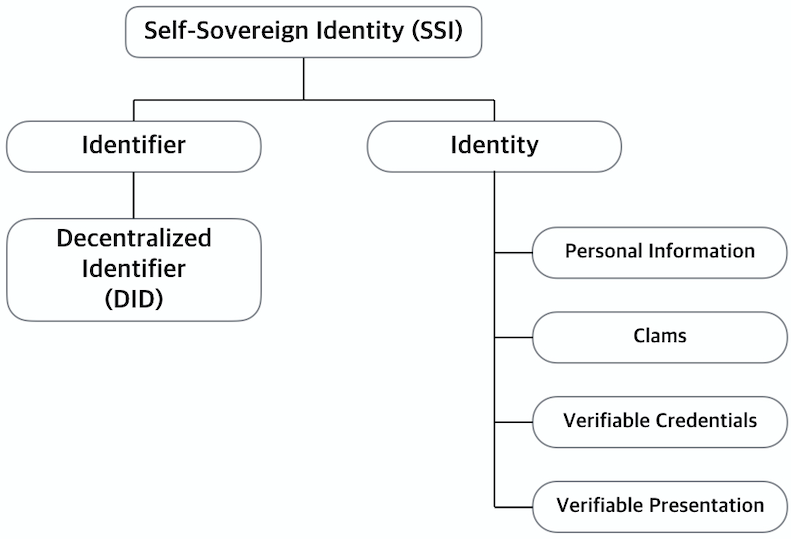

# 자기주권신원 (SSI: Self Sovereign Identity)

## 기존 신원 증명 방법
  * 서비스 사이트마다 등록된 아이디와 패스워드를 사용하여 개인 신원 증명
    - 
  * 중간의 중계자를 통해 개인의 신원을 증명
    + OAuth 

## Problems (문제)
상황에 따라 요구되는 신원 정보가 다른데 기존의 신원 증명 메커니즘에서는 필요한 신원 정보 이상의 
정보를 제공하는 경우가 많았다. 이러한 문제를 해결하기 위해 Self Sovereign Identity가 제안되었다.

## What is SSI? (자기주권신원이란?)

자기 주권 신원이란 "사용자 스스로 독립적인 권한을 갖는 신원"으로 사용자가 신원 정보에 대한 권한을 가진다고 할 수 있다. 
새로운 신원증명 패러다임으로 중앙화된 기관으로 부터 인정된 획일화된 신원 증명 방식이 아닌 
개인이 신원 정보에 대한 권한을 가지고 자신의 신원을 관리하고 활용할 수 환경으로 변화하는 것이다.

사이버 공간에서 자기주권신원을 형성하기 위해서 두 가지 요소를 사용하고 있다.
* 식별자(Identifier): 디지털 세상에서 '내'가 '나'임을 증명하기 위한 식별자
* 신원(Identity): '나'라는 개체에 해당되는 '정보/속성'을 제시하고 증명하는 정보

식별자는 탈중앙형 신원(Decentralized Identity)이고 신원 데이터는 개인정보(Personal Information), 자격증명(Clames), 
증명가능한 자격증명(Verifiable Credentials), 증명가능한 표현(Verifiable Presentation)로 구성된다. 
또한 이러한 데이터들이 저장되는 데이터 저장소를 신원 허브(Identity Hub)라고 한다. 

## 

## How to work SSI (SSI 동작원리)

사용자는 복수의 DID 

## Standard related to SSI (자기 주권 신원 관련 표준)

 

## Reference

* [글로벌 밋업 페이지](https://ssimeetup.org/)
