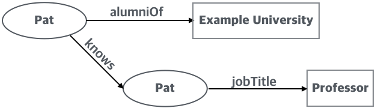

# Verifiable Credential (검증가능한 자격증명)

## Terminology (용어)

검증가능한 자격증명와 관련한 용어로는 다음과 같은 것이 있다. 

* claim(주장): 주체(subject)에 관해 만들어진 주장(assertion) 또는 주체와 관련한 문장 
* credential(자격증명): 발급자에 의해서 만들어진 하나 이상의 주장의 집합. 
검증가능한 자격증명(verifiable credential)는 암호로 검증할 수 있는 권한을 가진  방지 자격증명이다.
검증가능한 자격증명는 암호로 검증할 수 있는 검증가능한 표현(verifiable presentation)을 생성하는데 사용할 수 있다.
자격증명 내의 주장은 다른 주체에 관한 것일 수 있다.
* data minimization(데이터 최소화): 공유 데이터의 양을 작업 또는 목표를 성공적으로 달성하는데 필요한 최소량으로 엄격하게 제한하는 행위
* decentralized identifier(탈중앙형 식별자): 
엔티티와 연관된 휴대용 URL 기반 식별자로 DID라고 한다.
이 식별자는 검증가능한 자격증명에서 가장 많이 사용되며 주체와 관련한 것이다.
자격증명를 재발급 할 필요없이 한 저장소에서 다른 저장소로 쉽게 이식할 수 있는 검증가능 자격증명 
* decentralized identifier document (탈중앙형 식별자 문서): 
DID 문서라고도 하며 검증가능 데이터 저장소를 사용하여 접근이 가능한 문서로 관련 저정소와 공개키 정보와 같은 
특정 탈중앙형 식별자와 연관된 정보를 포함한다. 
* derived predicate(파생된 술어):
검증가능한 자격증명의 다른 속성 값에 대한 검증가능한 부울주장
이들은 정보 공개를 제한할 수 있기 때문에 영지식 증명 형식의 검증가능한 표현에 유용하다.
예로 검증가능한 자격증명가 센티미터로 특정 키를 표현하는 속성을 포함하면, 
파생된 술어는 검증가능한 자격증명 내의 키 속성을 참조하여
특정 키 값을 실제 공개하지 않고 자격증명의 키 값이 최소 키 요구사항을 만족하는지 발급자가 
증명하는 것을 보여줄 수 있다. 예로 주체는 150 센티미터 보다 크다는 것이다. 
* digital signature(디지털 서명):
디지털 메시지의 진위 여부를 보여주는 수학적 방법
* entity(엔티티):
생태계에서 하나 이상의 역할을 수행하는 사람, 조직, 디바이스와 같은 독특하고 독럽적으로 존재하는 것
* graph(그래프):
주체와 다른 주체 또는 데이터와의 관계로 구성된 정보 네트워크
* holder(보유자):
하나 이상의 검증가능 자격증명를 보유하고 이로부터 표현을 생성하는 엔티티이다. 
보유자는 항상 보유하고 있는 검증가능한 자격증명의 주체는 아니다.
보유자는 자격증명 저장소에 자격증명를 저장한다.
* identity(신원):
상황에서 엔티티를 추적하는 수단이다.
디지털 신원은 특히 식별자와 속성을 사용하여 디지털 상황에서 엔티티 상호작용을 추적하고 
커스터마이징할 수 있게 한다. 
자격증명(identity information)의 의도하지 않은 배포 또는 사용은 개인정보를 침해할 수 있다.
이러한 정보의 수집 및 사용은 데이터 최소화 원칙을 따라야 한다.
* identity provider(신원 제공자):
페더레이션 또는 분산네트워크 내 신뢰 단체 애플리케이션에 인증 서비스를 제공하는 동안 
보유자를 위해 자격증명를 생성, 유지, 관리하는 시스템이다. 이 경우 자격증명 보유자가 항상 주체이다

검증가능 자격증명가 베어러 자격증명인 경우에도 검증가능 자격증명가 주체와 함께 남아있고 
그렇지 않은 경우 공격자에게 도난당했다는 것을 가정이다. 

W3C의 Verifiable Credential Data model 규격에서는 신원 제공자 개념을 발급자와 
보유자의 두가지 개념으로 분리한다. 
* issuer(발급자):
하나 이상의 주체에 관한 주장을 주장하고 이들 주장으로 부터 검증가능 자격증명를 생성하고 보유자에게 전달한다. 
* presentation(표현): 
하나 이상의 검증가능 자격증명로 부터 만들어진 데이터로 하나 이상의 발급자가 블급하고 특정 검증자와 공유된다. 
데이터의 소유권이 암호화 검증절차 후 데이터 소유권을 신뢰할 수 있는 방식으로 인코딩되어 변조방지된 표현이 
검증가능한 표현이다. 특정 유형의 검증가능 표현은 원래 검증가능한 자격증명를 포함하고 있지 않으나 
그것으로 부터 합성된 데이터를 포함할 수 있다(예: 영 지식 증명).
* repository(저장소):
보유자의 검증가능 자격증명을 저장하고 접근을 보호하는 개인 검증가능 자격증명 지갑 또는 저장장소 같은 프로그램
* selective disclousure(선택적인 공개):
어떤 정보를 공유할 것인지에 대한 세밀한 결정을 하는 보유자의 능력
* subject(주체):
하나 이상의 검증가능한 자격증명를 주장하는 개체(entity)로 사람, 동물, 사물 등을 포함하고 있다.
많은 경우 검증가능한 자격증명 보유자가 주체이나 그렇지 않은 경우도 있다. 
예로 부모(보유자)는 아이(주체)에 대한 검증가능한 자격증명를 가지거나 
애완동물의 주인(보유자)는 그들의 애완동물(주체)의 검증가능한 자격증명를 가질 수 있다.
* user agent(사용자 에이전트):
보유자, 발급자, 검증자 간의 통신을 중재하는 브라우저 또는 다른 웹 클라이언트 같은 프로그램 
* validation(확인):
검증가능 자격증명 또는 검증가능 표현이 검증자와 다른 관련 이해 관계자의 요구를 충족시킨다는 보장 
검증가능 자격증명 또는 표현의 학인은 W3C verified credential data model 규격의 범위는 아니다.
* verifiable data registry(검증가능한 데이터 저장소):
검증가능한 자격증명를 사용하는데 요구될 수 있는 식별자와 검증가능한 자격증명 스키마, 해지 정보, 발급자의 공개키 등과 같은 
관련 데이터의 생성 및 검증을 중재하는 시스템으로 일부 구성에서는 주체와 상관 가능하는 식별자들을 요구할 수 있다. 
UUID와 공개키와 같은 일부 저장소는 식별자의 이름공간(Namespace) 역할을 한다. 
검증가능한 데이터 저장소의 예로는 신뢰할 수 있는 데이터베이스, 탈 중앙형 데이터베이스, 
정부 신분 데이터베이스 및 분산 원장이 있다. 생태계에서는 사용가능한 검증가능한 데이터저장소 유형이 여러개 존재한다.  
* verification(검증):
검증가능한 자격증명 또는 검증가능한 표현이 각각 발급자 또는 발표자(presenter)의 진술이 진실되고 시기 적절한지에 대한 평가
자격증명와 표현이 규격을 따르는지도 평가 
* verifier(검증자): 
처리를 위해 선택적으로 검증가능한 표현 내에 있는 하나 이상의 검증가능한 자격증명를 수신한다. 다른 규격에서는 이 개념을
"relying party(신뢰 단체)" 라고도 한다. 

* bearer credential(무기명 자격증명): 
공연 티켓과 같이 정보의 개인정보 보호를 강화한 것으로 
보유자에 관한 민감한 정보를 누설(divulge)하지 않고 무기명 자격증명의 보유자에게 특정 자원에 대한 권한을 부여한다.
이는 무기명 자격증명의 공유하는 것이 중요하지 않거나 큰 경제적 또는 평판 손실이 일어나지 않을 경우에 사용된다. 

무기명 자격증명은 검증가능한 자격증명은 **credentialSubject** 속성에 중첩된 id 속성을 사용하여 표현하는 
주체 식별자를 규정하지 않는 것으로 가능하다. 

무기명 자격증명은 개인정보 보호를 강화할 수 있으나 이것의 보유자가 예상한 것 보다 많은 정보가 실수로 누설되지 않도록 
주의깊게 만들어야 한다. 
예로 여러 사이트에 동일한 무기명 자격증명을 반복적으로 사용하는 것은 잠재적으로 이들 사이트가 보유자를 부적절하게 
추적하고 연관성을 찾기 위해 결탁하게 한다. 
생일과 우편번호와 같은 식별자의 역할을 못할 것 같은 정보도 동일한 무기명 자격증명 또는 세션 내에서 함께 사용될 경우
개인을 통계적으로 식별하는데 사용될 수 있다. 

무기명 자격증명의 발급자는 무기명 자격증명이 개인정보 강화의 장점을 제공을 하도록 유지해야 한다.
* 가능하면 한번 사용한다.
* 개인적인 식별 정보를 포함하지 않는다.
* 과도하게 연관되지 않아야 한다.

민감한 정보가 포함돈 무기명 자격증명이 발급 또는 요구되거나 하나 이상의 세션의 둘 이상의 
무기명 자격증명를 조합하여 연관될 위험이 있다면 소프트웨어는 보유자에게 경고메시지를 보내야 한다.
모든 연계 위험은 검출하는 것은 불가능하지만 일부는 확실하게 검출이 가능할 것이다.

검증자는 보유자를 과도하게 연계하는데 사용될 수 있는 무기명 자격증명을 요청하면 안된다. 

## Core Data Model (핵심 데이터 모델)

핵심 데이터 모델에는 주장(Claims), 자격즘영(Credentials), 표현(Presentaion) 들이 있다. 

### 주장 (Claims)

주장(claim)은 주체(subject)에 관한 서술(statement)이다. 주체는 주장이 만들어질 수 있는 대성이다. 
기본적으로 주장은 다음과 같이 주체(subject)-속성(property)-값(value)의 관계로 표현한다. 

<주장의 기본 구조: source W3c Verifiable Credentials Data Model 1.0>

이 모델은 주체에 대한 다앙한 서술을 하는데 사용할 수 있다. 한 예로 특정인이 특정 대학을 졸업하였는지를 표현할 수 있다. 다음 예는
Pat 가 "Example University의 졸업생"이라는 것을 표현하는 기본적인 주장이다. 

또한 개별적인 주장은 주체에 대한 정보의 그래프 표현을 위해 합칠 수 있다. 이 그래프는 주체와 다른 주체 또는 데이터와의 관계로 구성된 정보의 네트워크이다.
다음은 앞의 예에 Pat가 Sam을 알고 있고 Sam의 직업이 교수라는 것을 나타내는 그래프이다. 

{Q} "이러한 주장들이 믿을 수 있기 위해서 더 많은 정보들이 그래프에 추가될 것이 기대된다" 고 하는데 이 그래프를 구성하는 주체는? 

